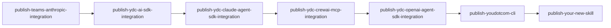

# Add Skill

Coordinate adding a new external skill to the `agent-skills` repository. Covers
scaffolding, publish workflow registration, and symlink creation.

## When to Use

Use this skill when:
- Adding a new SDK/framework integration skill to `skills/`
- Adding a new CLI tool wrapper skill to `skills/`
- Any time a `skills/<skill-name>/` directory needs to be created and registered

## Decision Point

**Ask first:**

> Is this an integration skill (agent generates code + tests calling real APIs)
> or a tool skill (agent runs a CLI command)?

- **Integration** → Invoke `create-seed-skill`, then continue with [Steps 2–4](#step-2--register-in-publishyml)
- **Tool** → Scaffold manually starting at [Step 1](#step-1--scaffold-the-skill-directory)

---

## Integration Skill Workflow

Integration skills wrap SDKs or frameworks where the agent generates runnable
code and integration tests.

**Examples:** `ydc-ai-sdk-integration`, `teams-anthropic-integration`, `ydc-openai-agent-sdk-integration`

### Step 1 (integration) — Invoke create-seed-skill

Activate the `create-seed-skill` skill. It handles:
- Collecting skill info (name, packages, language, paths A/B, env vars, test query)
- Generating `skills/<skill-name>/SKILL.md` and `assets/`
- Appending to `data/prompts/prompts.jsonl`

Complete the `create-seed-skill` workflow fully before proceeding to Step 2.

---

## Tool Skill Workflow

Tool skills are CLI wrappers where the agent runs commands rather than writing code.

**Examples:** `youdotcom-cli`

### Step 1 — Scaffold the skill directory

Create the skill directory and `SKILL.md` at `skills/<skill-name>/SKILL.md`.

**Required frontmatter:**
```yaml
---
name: <skill-name>
description: |
  One-line summary. When to activate.
license: <ISC|MIT|Apache-2.0>
compatibility: <runtime requirements, e.g. "Requires Bun 1.3+">
metadata:
  author: youdotcom-oss
  version: "1.0.0"
  category: <tool|integration|scaffolding>
  keywords: <comma-separated>
---
```

Validate immediately:
```bash
bunx @plaited/development-skills validate-skill skills/<skill-name>
```

---

## Step 2 — Register in publish.yml

Two edits to `.github/workflows/publish.yml`:

### 2a — Add input

Under `on.workflow_dispatch.inputs`, add:
```yaml
<skill-name>:
  description: "<skill-name>"
  required: false
  type: choice
  default: skip
  options:
    - skip
    - patch
    - minor
    - major
```

### 2b — Add job

Append at the **end** of the `jobs:` section. The new job must `needs` the
current last job to preserve push serialization:

```yaml
publish-<skill-name>:
  needs: <current-last-job>
  if: ${{ always() && inputs['<skill-name>'] != 'skip' }}
  uses: ./.github/workflows/_publish.yml
  with:
    skill_name: "<skill-name>"
    bump_type: ${{ inputs['<skill-name>'] }}
  secrets:
    PUBLISH_TOKEN: ${{ secrets.PUBLISH_TOKEN }}
```

**Current job chain** — always append after the last entry:



The `always()` in `if:` is required — without it a skipped predecessor causes
the dependent job to be skipped too, even if this skill was selected.

---

## Step 3 — Create symlink

External skills symlink from `.claude/skills/` into `skills/`:
```bash
ln -s ../../skills/<skill-name> .claude/skills/<skill-name>
```

Note: internal skills (in `.agents/skills/`) use a different target:
`../../.agents/skills/<skill-name>` — but this skill only handles external skills.

---

## Step 4 — Final validation

```bash
bunx @plaited/development-skills validate-skill skills/<skill-name>
```

Confirm the output reports `valid: true` before committing.

---

## Related Skills

- `create-seed-skill` — Full scaffolding workflow for integration-type skills (SKILL.md + assets + prompts.jsonl)
- `validate-skill` — Validate any skill's structure against the AgentSkills spec
